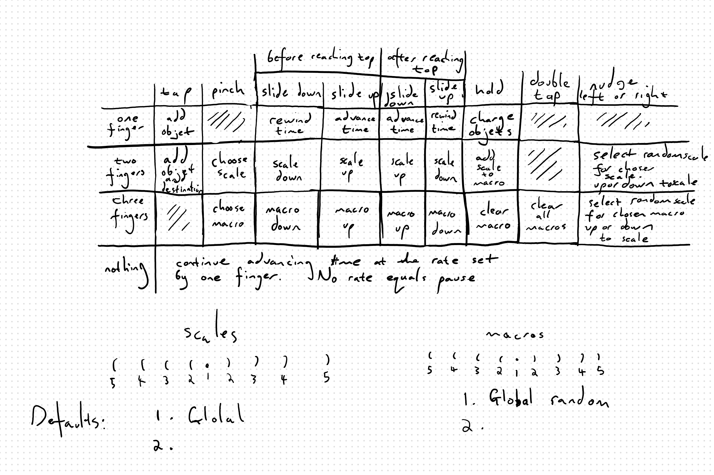

# Linaeyeux

A color organ or light synthesizer (a machine/application for generating and performing lumia, or light music, through a novel interface) with features for graphism (the expression of abstract thought in material symbols).

*Linae is latin for line, yeux is french for light.*


Inspired by Thomas Wilfred and his clavilux, and Fry and his holophonor, and Hime and her spaceship.

## User stories

```
As a user,
so I can see something unique,
I want to generate detailed and varied images over time
```

```
As a user,
so I can have a rich experience,
I want the interface to have deep potential for exploration and expression
```

```
As a user,
so I can have some control over what is generated,
I want to be able to change parameters
```

```
As a user,
so I can group parameters for easy adjusting,
I want to be able to assign them to macros
```

```
As a user,
so I can set up the intrument the way I like it,
I want to be able to change the default input and macro parameter settings
```

```
As a user,
so I can determine the duration of the piece,
I want to control the speed of generation
```

```
As a user,
so I can perform for an audience pieces I have practiced or improvised, 
I want only a subtle GUI or HUD
```

```
As a user,
so I can share what I made,
I want to save the video process and individual images
```

```
As a user,
so I can share what I made,
I want to upload the piece for playback by other users
```

```
As a user,
so I can be inspired,
I want to explore pieces submitted by other users
```

```
As a developer,
so I can build better games,
I want to improve my use of components and events
```

```
As a developer,
so I can explore code ideas,
I want all the variable parameters to be on interactive sliding scales
```

```
As a developer,
so I can quickly iterate control designs,
I want to be able to easily assign controls to input
```

## Design

The images can vary from being completely abstract textures to narrative arrangements.

Played out in time, they can be seen as exploratory performances.

The interface is like an adaptive instrument, starting from a simple slide up and down, and unfolding

The first scale is time (framerate). Higher on the scale, the faster everything updates

Sliding up is the journey out of the navel, the journey back after reaching the top

One or two or three fingers
 - one: time
 - two: scales
 - three: macros

Several scales available for sliding:

- Paths and nodes
- Random and ordered
- Light and dark
- Straight and curved
- Cold and warm
- Small and big
- Structured and free
- Moving and still
- Ephemeral and persistent
- Soft and hard
- Saturated and monochrome
- Empty and full
- Rigid and fluid

All scales have an accompanying random scale

All controls abstract upwards ie all randomness scales can be controlled individually, or with one slider, through using macros

Emergent significance.
The percieved combination of scales over time adds up to meaning, like music

Scales affect the behaviour of objets moving around the canvas

Tap to add objets

Objets destination defaults to the center of the screen. The player can change this by dragging

Destinations and objets cannot leave the canvas

Symmetry on x and y

Rewind time. This could be tricky to implement.

With skill, the player can feel like an orchestra conductor

## User input



## Notes

- Graphism began some 30,000 years BC, not as a photographic representation of reality but as an abstraction that was geared toward magical-religious matters. Early graphism then was a form of writing that constitutes a 'symbolic transposition'.

- I've wanted to make a color organ for years, and previously designed a mechanical one. I'm going to develop this idea slowly, for fun, when I don't feel like working on other projects.